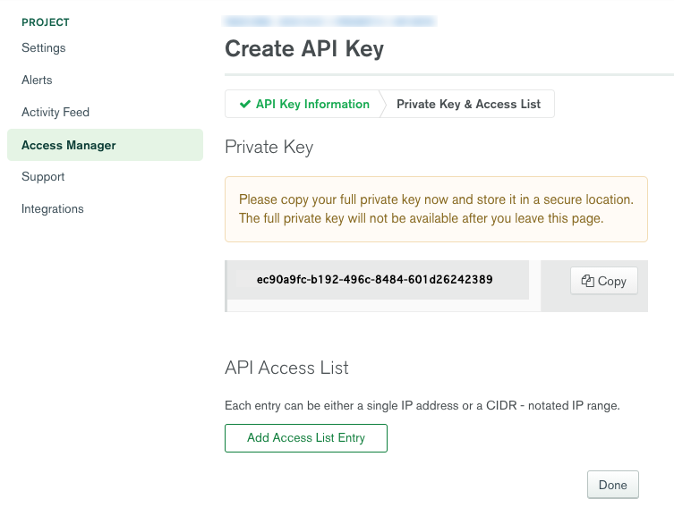

# Raydreams.Atlas

## Disclaimer

This is example code to access your Atlas Mongo Clusters. In order to do this you have to create an API Key that will have some privileges to your cluster or organization. This could open up your data to outsiders if you don't know how to manage your private key. Hire an expert if you don't know what you are doing. You should always try this out on a test cluster first.

There's no warranty with this code and you use it at your own risk. It has not been rigorously tested. If you spot an issue, let me know.

## Description

The `AtlasManager.cs` and `AtlasObjects.cs` files are the only fiiles you need to use this. I've included some other convenience functions for demo purposes.

This is written as a command line exe that loads the public and private keys from an app.config file (see below). You should be really careful where you put these keys in the real world. I strongly advise using something like Azure KeyVault. Seriously, you're an idiot if you store production keys in a plain text config file like most of corporate American does.

## Usage

Like I said, this is a demo from a CL exe. The irony is I use this code from an Azure Function called by an Azure Logic app on a reoccurrence schedule.

You can of course hit this API from a tool like Postman but you are mostly likely here because you want to setup some kind of schedule.

## The Atlas API

Here is the [Atlas API documention](https://docs.atlas.mongodb.com/reference/api-resources)

The Atlas API has this format:

```
https://cloud.mongodb.com/api/atlas/v1.0/
```

Then followed by all the various commands and input parameters

## Implemented Functions (so far)

* GetProjects - Gets a list of all the Projects that the Key has read access to.
* GetClusters - Gets all the clusters in the specified Project.
* GetClusterInfo - Gets all the information about the specified cluster.
* PauseCluster - Pauses or resumes the specified cluster (this is why you are here)

## Configuration

You need to include an app.config file with keys at the same level as the .csproj file for this to work or just edit the `Program.cs` fields.
For obvious security reasons this file has been removed, because, you know, I still gotta test it myself.

The Public and Private Key you will get from inside your Atlas Dashboard (see below how to make the keys).

```
<?xml version="1.0" encoding="utf-8"?>
    <configuration>
        <appSettings>
        <add key = "publicKey" value=""/>
        <add key = "privateKey" value=""/>
        <add key = "projectID" value=""/>
        <add key = "clusterName" value=""/>
    </appSettings>
</configuration>
```

## Atlas API Key Generation

You'll need to setup an API Key to use the Atlas APIs. Atlas offers tutorials on this but here's the basics yet again:

Beaware to can setup at Key at either the Organization or Project Level, or both. However, obviously keys at the org level are very powerful and have a lot more rights. I suggest you stick to the project level unless you are building utilities to manage **all** your projects in once place.

Next to the Project Name click the ellipse and choose Project Settings and then Access Manager, and finally over to the API Keys tab (yea, I know, the Atlas UI is not the greatest).


Click Create A New Key and give it some description for its use. In order to pause a cluster it has to be a **Project Cluster Manager**.
Copy the Public Key (though this is easy to get back) and click next.


Now copy the private key before leaving this screen. This is the only time you can see it.
Click Add Access List Entry which is just an IP permit list. You can choose to allow any IP with `0.0.0.0/0` but I strongly suggest you limit the IP ranges this key can be used.



Save the first IP. You can add more later.


The final screen shows your new key and lets you edit it.


Got that! Great!

## Other Help

There's also a [Python implementation](https://github.com/jdrumgoole/MongoDB-Atlas-API) which has more of the implemented API functions.

Mongo also has a [Blog Tutorial](https://www.mongodb.com/blog/post/atlas-cluster-automation-using-scheduled-triggers) if you want to use the triggers and Realm but honestly I found this way rediculously convoluted.